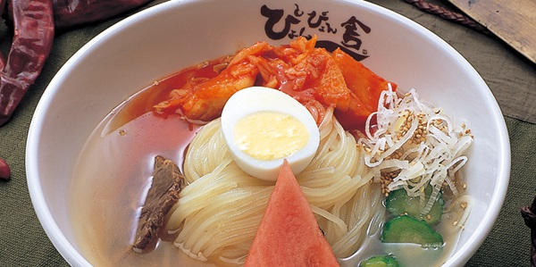

<!-- _class: lead -->

# About Me
## Daiki Iwasaki

---

<!-- header: "" -->

# 👋 About Me

- Name: Daiki Iwasaki
- Hometown: Morioka, Iwate
- Birthday: Sep 15th, 2005
- Hobbies: 
  - Reading tech articles on Qiita, Zenn, Note
    - e.g. Marp, Tailwind CSS, Deep Research(Gemini)
  - Listening to music (Avicii, Marshmello, NEFFEX)

---

# 📚 What I'm Working On

- Studying mathematics
  - Calculus, Linear Algebra
- Learning Web development (React, Next.js)

| Form UI             | Code              |
| ------------------- | ----------------- |
|  | 

> Form Design: CSSnippets, https:\//cssnippets.shefali.dev/forms

---

# Event and Foods in Morioka

<!-- _class: lead -->

---

# 🥁 Sansa Odori

- A traditional dance festival held in Morioka every summer, from Aug 1st to 4th
- Attracted over **1.4 million** visitors in 2019, and about 1.1 million in 2024
- One of the largest drum parades in Japan

> Image: 東北のまつり, 東北六県商工会議所連合会, https\://www.tohokumatsuri.jp/cate_iwate/post-265/

--- 

# 🍜 Morioka's Three Great Noodles

- **Wanko Soba**: All-you-can-eat style small bowls of soba noodles
- **Morioka Reimen**: Cold noodles with a refreshing spicy soup
- **Jajamen**: Thick wheat noodles with rich meat-miso sauce

| Wanko Soba | Morioka Reimen | Jajamen |
| ---------- | ---------- | ---------- |
|  |  |  |

> Images: 東家、ぴょんぴょん舎

---

# Thank You for Attention!
### Let's enjoy every moment and create great memories together!!

<!-- _class: lead -->
